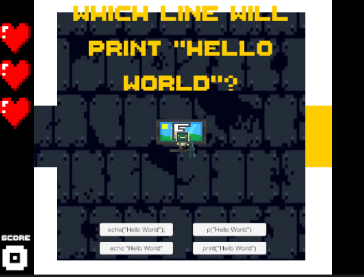
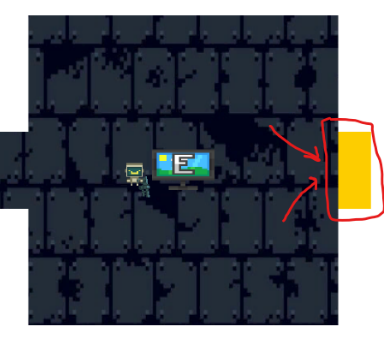
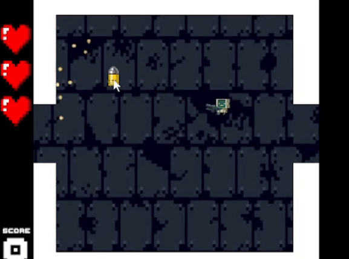

# Byte The Bullet
Byte The Bullet is an educational game meant to help players hone their basic Python coding skills using coding problems alongside engaging gameplay.

# Developers
- Alexander Peluso (apeluso@udel.edu)
- Kyle Malice (malice@udel.edu)
- James Lloyd (jclloyd@udel.edu)

# About
You wake up in a mysterious dungeon, surrounded by enemies and bad code. You need to escape the only way you know how - your vast coding knowledge. In this Enter the Gungeon-inspired top down shooter, you will fight enemies and solve python coding problems to advance through the dungeon. Can you defeat the final boss and escape the dungeon, or will you Byte the Bullet trying?

# Instructions
[Play Here!](https://apeluso03.github.io/Byte_The_Bullet/)
## Controls
WASD to move
Use the Mouse to aim
Left Click to fire
Space to dodge roll
E to interact

# Screenshots
 
 

# Trailer
[Link](https://www.youtube.com/watch?v=-QafAWPW3FY&ab_channel=apel)

# EGDD
[EGDD Link](https://github.com/apeluso03/Byte_The_Bullet/blob/main/docs/egdd.md)

# Credits
## Sprites
Some sprites used in this project are from Enter The Gungeon and are the property of creators Dodge Roll and publisher Devolver Digital

All rights belong to their respective owners. Used here for educational purposes only.

- Sprite source: [Spriters Resource](https://www.spriters-resource.com/pc_computer/enterthegungeon/)

## SFX
- [BGM](https://www.fesliyanstudios.com/royalty-free-music/download/8-bit-adventure/2282)
- [Wrong Answer Sound](https://pixabay.com/sound-effects/wronganswer-37702/)
- [Correct Answer Sound](https://pixabay.com/sound-effects/correct-choice-43861/)

# Links
- [Game Deployment](https://apeluso03.github.io/Byte_The_Bullet/)
- [Trailer](https://www.youtube.com/watch?v=-QafAWPW3FY&ab_channel=apel)
- [Slides Presentation](https://docs.google.com/presentation/d/1IABZwwn1UUpvBmw21MLisPKcqVkrgqSdMTJ2ehTQ2tQ/edit?slide=id.p#slide=id.p)
